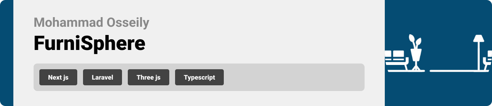

<br><br>

<!-- project philosophy -->


> FurniSphere offers an immersive 360-degree view of furniture, allowing users to explore products in stunning detail. AI technology enables dynamic rearrangement of 3D models, while machine learning recommends products based on user preferences. It's not just shopping—it's a personalized, interactive experience.

### User Stories

- As a user, I want to browse the furniture collection, so I can find pieces that suit my taste and needs.
- As a user, I want to view the furniture in 360 degrees, so I can see the product from all angles and better understand its design and quality.
- As a user, I want to be able to edit in the space of the room.

### Admin Stories

- As an admin, I want to update the order status, so I can keep customers informed about the progress of their orders.
- As an admin, I want to update user profiles, so I can manage customer information and provide better service.
- As an admin, I want to edit the 3D model positions, so I can ensure the furniture items are displayed accurately in the virtual space.
- As an admin, I want to add new products to the furniture collection, so the catalog remains up to date with the latest offerings.
<br><br>
<!-- Tech stack -->


###  FurniSphere is built using the following technologies:

- Next.js & Three.js: The frontend is developed using Next.js and Three.js to create an interactive and dynamic 3D space tour, enabling users to explore the environment with enhanced performance and server-side rendering capabilities.
- Laravel & MySQL: The backend utilizes Laravel for server-side logic and application structure, with MySQL as the database to manage data efficiently. This setup supports robust operations and seamless integration with the frontend.


<br><br>
<!-- UI UX -->


> We designed FurniSphere  using wireframes and mockups, iterating on the design until we reached the ideal layout for easy navigation and a seamless user experience.

- Project Figma design [figma](https://www.figma.com/design/zwUhOLaPRnJbtnQzqAMyBs/FurniSpher?node-id=0-1&node-type=canvas&t=cP2lOQMxKSyh8nuS-0)


### Mockups
| Order History  | Register Page | Products Page |
| ---| ---| ---|
| 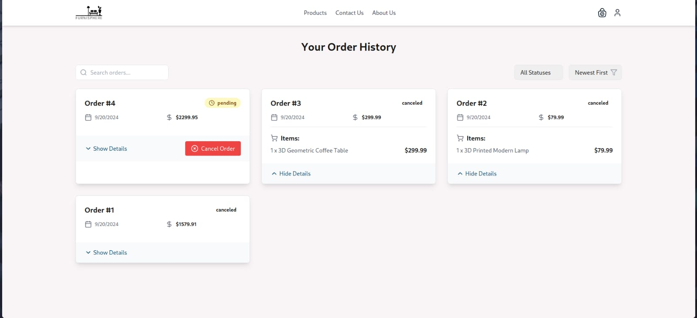 | 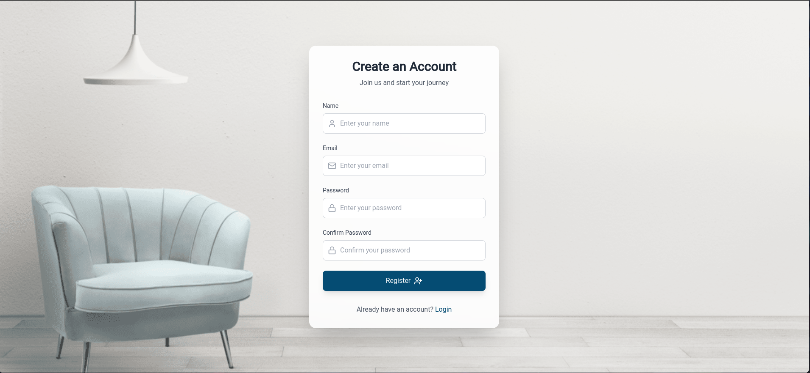 | 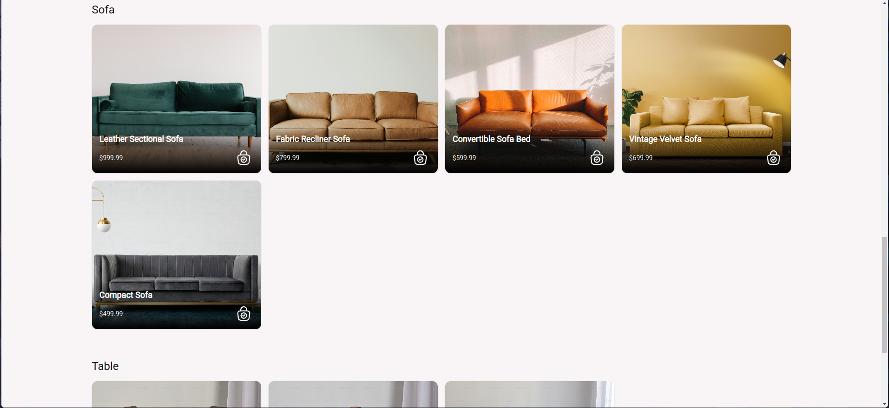 |

<br><br>

<!-- Database Design -->


###  Architecting Data Excellence: Innovative Database Design Strategies:

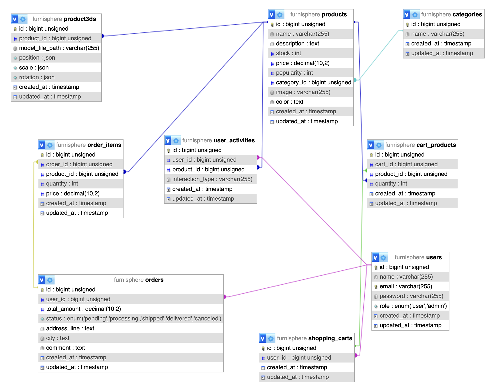

<br><br>


<!-- Implementation -->


### User Screens
| Home Page  | 3D screen |  
| ---| ---| 
|  | 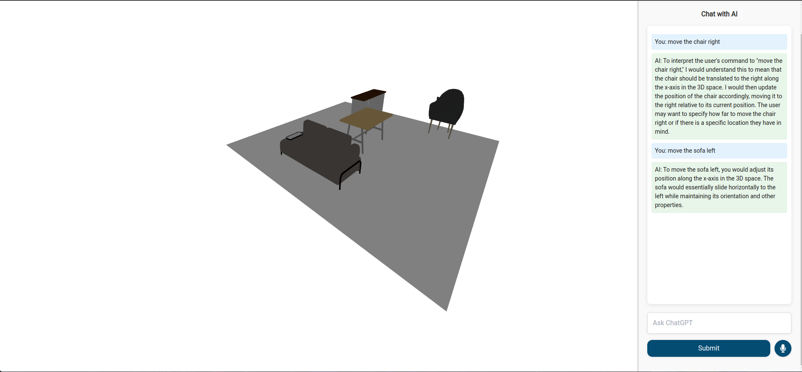 | 


### Admin Screens
| Order Mangment  | Add Products |  
| ---| ---| 
| 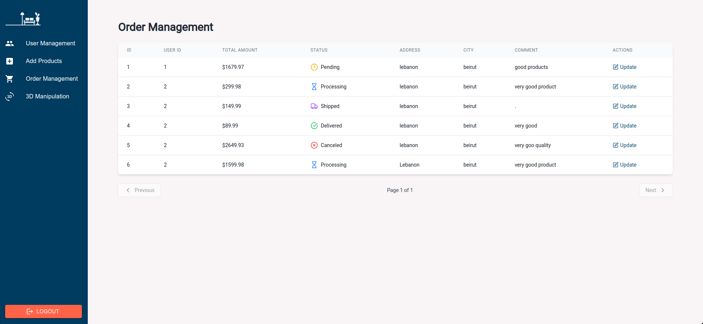 | 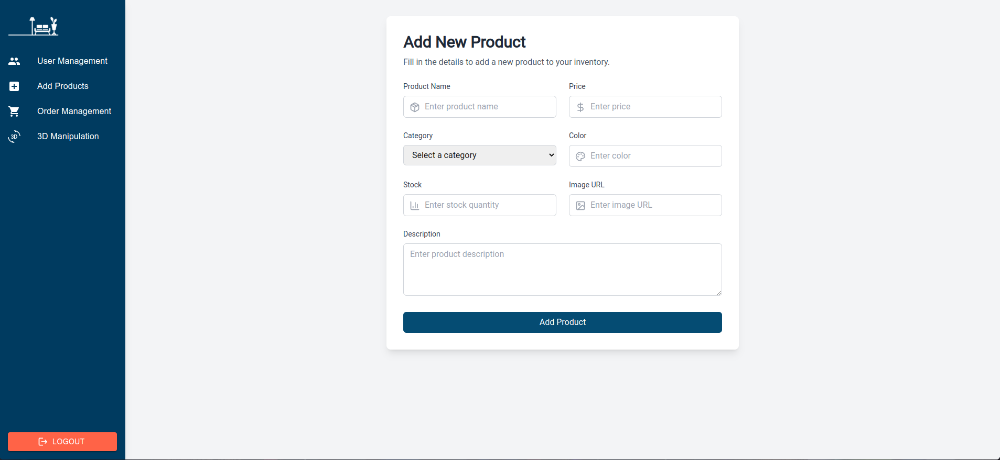 | 


<br><br>


<!-- Prompt Engineering -->


###  Enhancing 3D Shopping Experience with AI and Machine Learning:

- This project leverages 3D technology to showcase products interactively, allowing users to view and manipulate the product positions in a virtual environment. AI is integrated to enable dynamic changes in the 3D product placement, while machine learning algorithms analyze user behavior on the site to recommend products based on their interests, creating a personalized shopping experience.

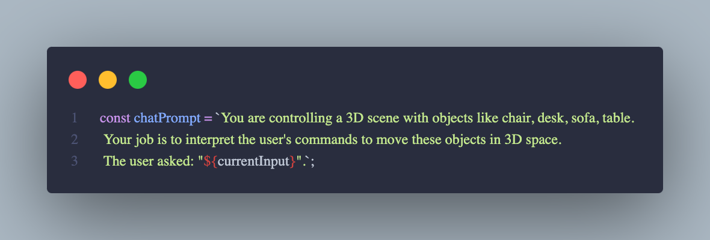

<br><br>

<!-- AWS Deployment -->


###  Efficient AI Deployment: Unleashing the Potential with AWS Integration:

- This project leverages AWS deployment strategies to seamlessly integrate and deploy natural language processing models. With a focus on scalability, reliability, and performance, we ensure that AI applications powered by these models deliver robust and responsive solutions for diverse use cases.

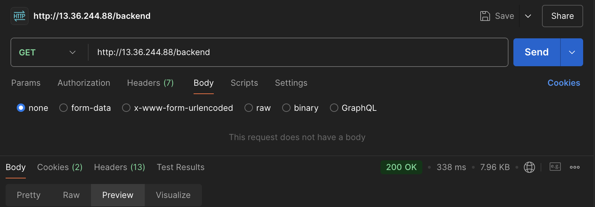

<br><br>

<!-- Unit Testing -->


###  Precision in Development: Harnessing the Power of Unit Testing:

- This project employs rigorous unit testing methodologies to ensure the reliability and accuracy of code components. By systematically evaluating individual units of the software, we guarantee a robust foundation, identifying and addressing potential issues early in the development process.

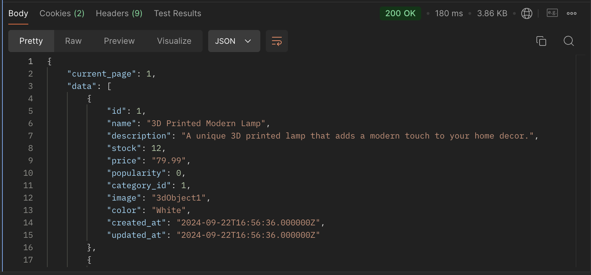

<br><br>


<!-- How to run -->


> To set up FurniSphere locally, follow these steps:

### Prerequisites

This is an example of how to list things you need to use the software and how to install them.
* npm
  ```sh
  npm install npm@latest -g
  ```
* php
  ```sh
  apt install php
  ```
* composer
  ```sh
   php -r "copy('https://getcomposer.org/installer', 'composer-setup.php');"
   php -r "if (hash_file('sha384', 'composer-setup.php') === 'dac665fdc30fdd8ec78b38b9800061b4150413ff2e3b6f88543c636f7cd84f6db9189d43a81e5503cda447da73c7e5b6') { echo 'Installer verified'; } else { echo 'Installer corrupt'; unlink('composer-setup.php'); } echo PHP_EOL;"
   php composer-setup.php
   php -r "unlink('composer-setup.php');"
  ```

### Installation

_Below is an example of how you can instruct your audience on installing and setting up your app. This template doesn't rely on any external dependencies or services._

1. git clone https://github.com/mohammad-osseily/FurniSphere-backend
2. cd FurniSphere-backend
3. cp .env.example .env
4. composer update
5. Enter your API in `.env`
   ```js
   const API_KEY = 'ENTER YOUR API';
   const JWT_SECRET = '';
   const JWT_ALGO = '';
   ```
6. php artisan serve
7. git clone https://github.com/mohammad-osseily/FurniSphere-frontend
8. cd FurniSphere-frontend
9. npm i
10. npm run dev

Now, you should be able to run FurniSphere locally and explore its features.
